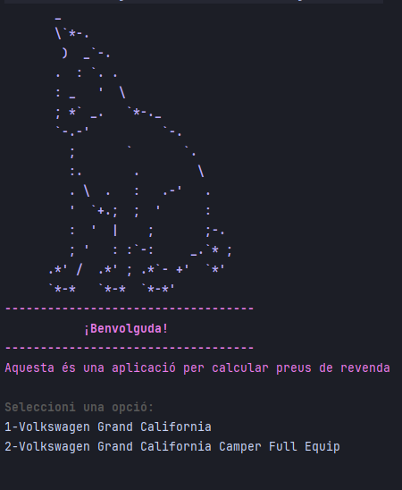
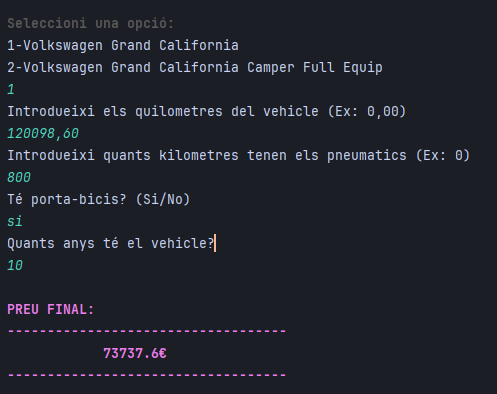
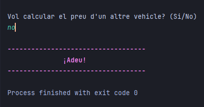
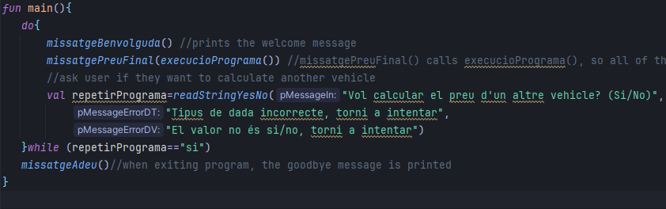
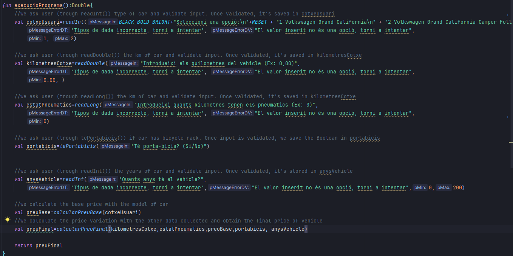

# Exercici VolksWagen :car:
- Autora:Anna Cano
- Data: 22/12/23

## Descripció
Programa que calcula el preu de revenda d'un VolksWagen. Es pot escollir entre dos models diferents: el Volkswagen Grand California o el Volkswagen Grand California Camper Full Equip. Depenent de quin es tria, el preu base varia i posteriorment, amb altres factors com el quilometratge i l'antiguitat, es devalua o incrementa el preu de revenda. Finalment, un cop calculat el preu, es pot sortir del programa o tornar a calcular el preu d'un altre vehicle.

## Funcionalitats :star:

- Escollir model de cotxe
- Inserir quilometratge del cotxe
- Inserir quilòmetres dels pneumàtics
- Indicar si té porta-bicis o no
- Inserir els anys del vehicle

## Execució

## Sneak-Peak codi :eyes:
Funció main:

Funció amb totes les funcionalitats: 

